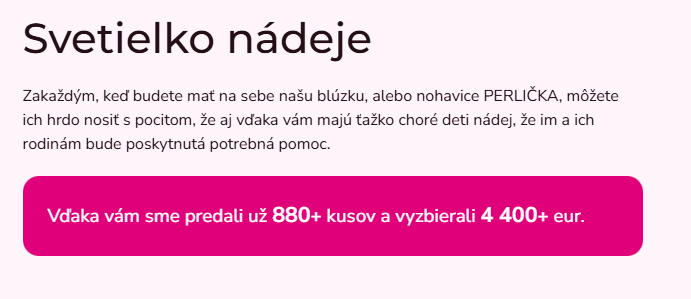
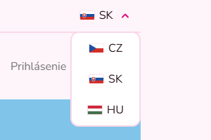
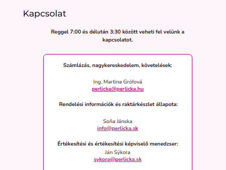
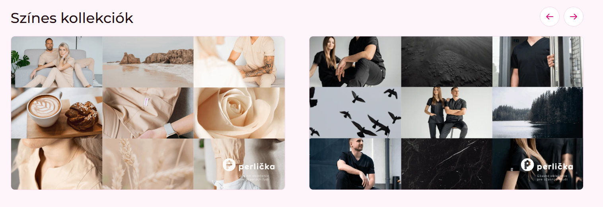
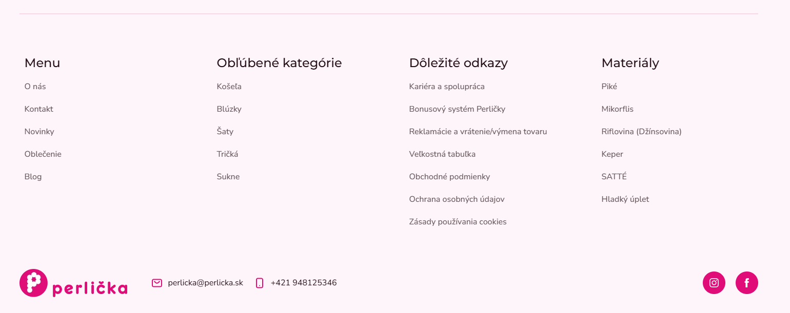
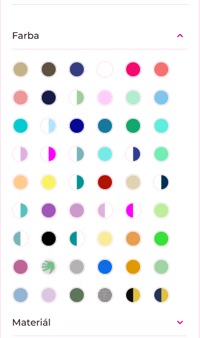
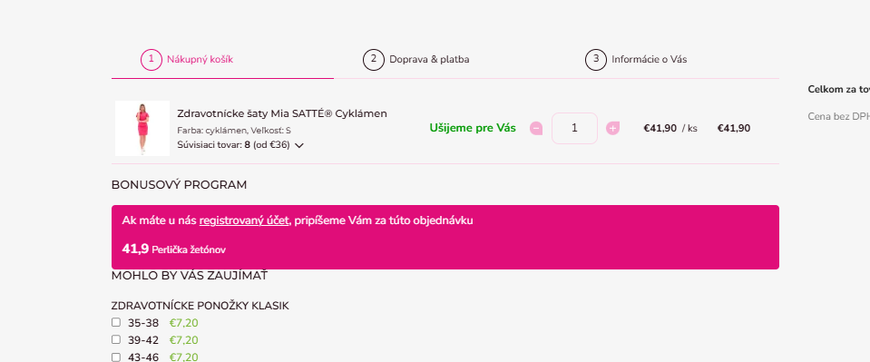
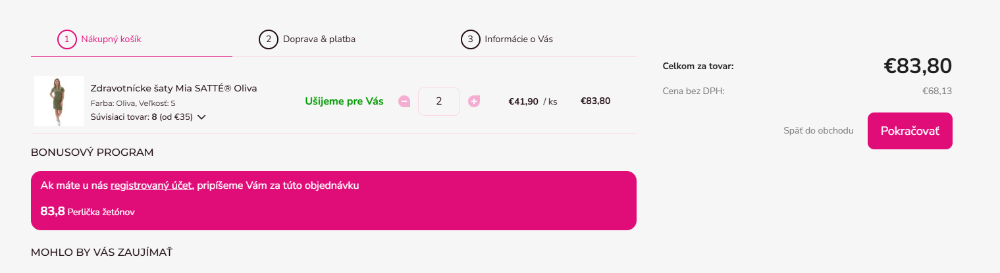
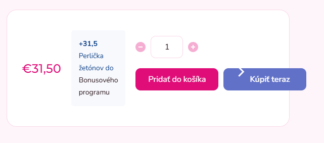
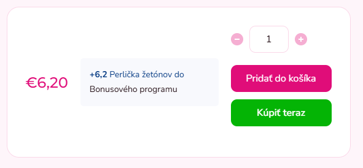

# Perlička E-shop – Frontend Improvements (SK / CZ / HU)

This repository contains real-world frontend improvements and feature implementations created for the **Perlička e-shop** across multiple regional versions.

The work focuses on UI customization, localization, responsiveness, and small functional features implemented directly via FTP on production websites.

---

## Supported Websites

- 🇸🇰 **Slovakia (SK)**  
  🔗 https://www.perlicka.sk/

- 🇨🇿 **Czech Republic (CZ)**  
  🔗 https://www.perlickashop.cz/

- 🇭🇺 **Hungary (HU)**  
  🔗 https://www.perlicka.hu/

---

## Technologies Used

- HTML5
- CSS
- JavaScript
- FTP (direct production deployment)
- SVG (custom flag)

---

## ✅ Implemented Features & Changes

### 1️. Counter (SK / CZ)

A simple counter implemented for selected pages on the Slovak and Czech versions of the e-shop.

- Lightweight JavaScript solution
- Integrated into existing page structure

📁 **Repository folder:**  
`/Counter`

🔗 **Live example:**  
https://www.perlicka.sk/svetielko-nadeje/  
https://www.perlickashop.cz/svetylko-nadeje/

---

### 2. Language Switcher (SK / CZ / HU)

Extended and deployed an existing language switcher across all regional e-shops, with additional customization for the Hungarian version.

- Deployed the language switcher on SK, CZ, and HU e-shops
- Integrated HU language option into the existing switcher
- Created custom Hungarian flag as SVG with pink frame
- Set Hungarian flag as primary on HU e-shop
- Reordered language options per regional requirements
- Adjusted styling to match the original design
- Ensured full responsiveness
- Implemented directly via FTP

📁 **Repository folder:**  
`/Lang_switcher`

🔗 **Live example:**  
https://www.perlicka.sk/  
https://www.perlickashop.cz/  
https://www.perlicka.hu/

---

### 3. Contact Page Update – HU (Kapcsolat)

Code cleanup and layout adjustments on the Hungarian contact page.

- Removed unnecessary category elements
- Improved page clarity
- Changes applied directly via FTP

📁 **Repository folder:**  
`/Contact_page_HU`

🔗 **Live page:**  
https://www.perlicka.hu/kapcsolat/

---

### 4. Base Color Collections – HU (Színes kollekciók)

Added basic color collections to the Hungarian e-shop.

- Adjusted styling for consistency

📁 **Repository folder:**  
`/Color_banner_HU`

🔗 **Live example:**  
https://www.perlicka.hu/
 
 

---

### 5. Footer – Popular Categories HU

Added a Popular Categories section into the footer of the Hungarian e-shop.

- Improved navigation
- Better UX for frequently visited categories
- Styled to match existing design

---

### 6. UI Tweaks Pack (SK / CZ / HU)

Batch of smaller UI/layout fixes and localization tweaks deployed via FTP.

| Task | Change | Region | Live |
|---|---|---|---|
| 6.1 | Footer logo  | SK/CZ/HU | https://www.perlicka.sk/ |
| 6.2 | HU button translations | HU | https://www.perlicka.hu/ |
| 6.3 | Footer “materials” column | SK | https://www.perlicka.sk/ |
| 6.4 | Frontpage video replaced | SK | https://www.perlicka.sk/ |
| 6.5 | Category Filters Default Active Color Filter  | SK/CZ/HU | https://www.perlicka.sk/zdravotnicke-oblecenie/ |
| 6.6 | B2B photos added | SK | https://www.perlicka.sk/oblecte-svoj-tim/ |
| 6.7 | Bonus program UI adjustments | SK/CZ | https://www.perlicka.sk/kosik/ |
| 6.8 | Reorder “favorite categories” | SK | https://www.perlicka.sk/ |
| 6.9 | Frontpage spacing/margins refinements | SK | https://www.perlicka.sk/ |

<b>6.1 Footer logo (SK/CZ/HU)</b>

- **What:** Added a custom footer logo (edited/optimized image) and linked it to the appropriate page to improve branding consistency across the e-shops.
- **Live:** https://www.perlicka.sk/ | https://www.perlickashop.cz/ | https://www.perlicka.hu/

<b>6.2 HU button translations (HU)</b>

- **What:** Updated button labels in Hungarian by editing the HTML  via FTP.
- **Live:** https://www.perlicka.hu/

<b>6.3 Footer “materials” column (SK)</b>

- **What:** Added a Materials column in the footer by creating a new articles/category section in Shoptet (no custom code).
- **Live:** https://www.perlicka.sk/ 

<b>6.4 Frontpage video replaced (SK)</b>

- **What:** Replaced frontpage video asset for better visual consistency.
- **Where:** `/Tasks/About_us_banner`
- **Live:** https://www.perlicka.sk/

<b>6.5 Category Filters – Default Active Color Filter (SK/CZ/HU)</b>

- **What:** Set the color filter section to be active/expanded by default using a small JavaScript tweak.
- **Where:** `/Tasks/Color_filter`
- **Live:** https://www.perlicka.sk/zdravotnicke-oblecenie/ 

<b>6.6 B2B photos added (SK)</b>

- **What:** Added B2B photos by inserting them directly into the page HTML
- **Live:** https://www.perlicka.sk/oblecte-svoj-tim/

<b>6.7 Bonus program UI adjustments (SK/CZ)</b>

- **What:** Updated the cart bonus program banner card styling (spacing, border radius, overflow).
- **Where:** `/Tasks/Bonus_program_banner`
- **Live:** https://www.perlicka.sk/kosik/ | https://www.perlickashop.cz/kosik/

**Before:**  

**After:**  

<b>6.8  Reorder “favorite categories” (SK)</b>

- **What:** Reordered the “Favorite Categories” section on the frontpage to improve layout and content priority.
- **Where:** `/Tasks/HomePage_layout`
- **Live:** https://www.perlicka.sk/

<b>6.9 Frontpage spacing/margins refinements (SK)</b>

- **What:** Reordered the “Favorite Categories” section on the frontpage using a small JavaScript tweak and adjusted spacing/styling via CSS to improve layout and content priority.
- **Where:** `/Tasks/HomePage_layout`
- **Live:** https://www.perlicka.sk/

---

### 7. Product detail – “Buy now” button styling (SK)

Improved the layout and styling of the **Add to cart / Buy now** buttons on the product detail page.

- “Buy now” button color adjusted (green) + centered text
- Removed the unnecessary arrow/icon from the “Buy now” button
- Added a darker hover state to match the default Shoptet button hover behavior

📁 **Repository folder:**  
`/Cart_button_SK`

🔗 **Live page:**  
https://www.perlicka.sk/zdravotnicke-ponozky-klasi/

**Before:**  

**After:**  

---
